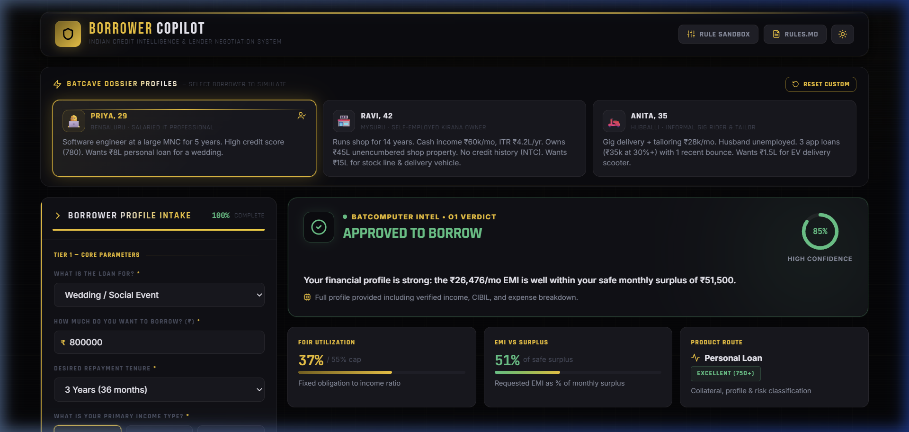
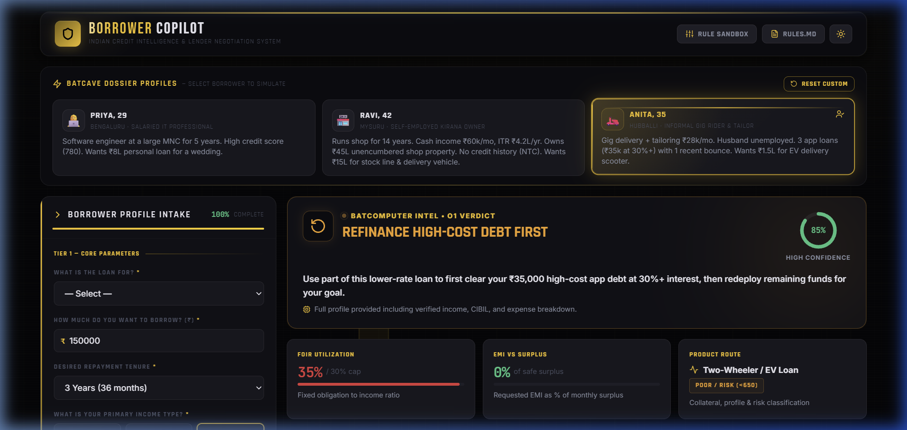
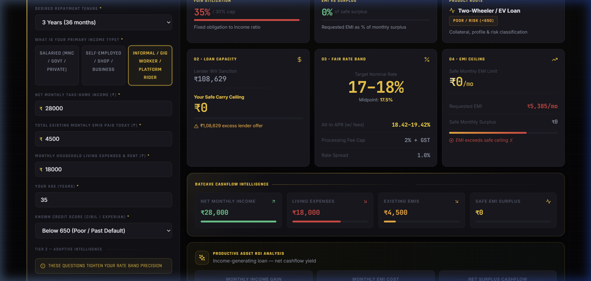
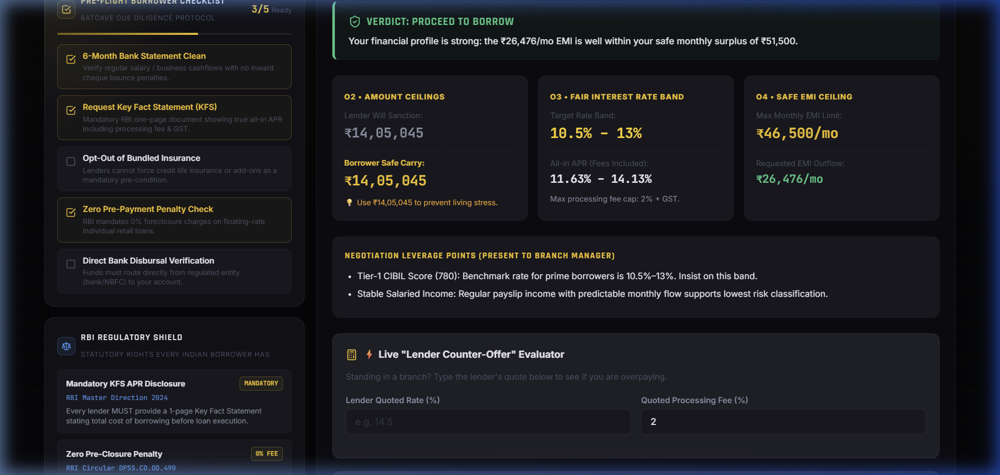

# 🦇 Borrower Copilot · Indian Credit Intelligence & Lender Negotiation System

[](https://navadeep206.github.io/borrower-copilot/)

> **Lokta Build Challenge Deliverable**  
> An agentic, client-side credit intelligence assistant designed to empower Indian borrowers before walking into a bank branch. Answers four core questions:  
> **1. Should I borrow at all?** (O1 Verdict)  
> **2. How much am I really eligible for?** (O2 Amount Ceilings: Lender Offer vs Safe Carry)  
> **3. What is a fair rate for me?** (O3 Fair Rate Band & All-in APR)  
> **4. What EMI should I agree to?** (O4 Safe EMI Ceiling & Stress Test)  
> Then equips the borrower with a print-ready **Lender Negotiation Dossier**, counter-offer evaluator, and branch dialogue script.
>
> 🔗 **Live URL:** [https://navadeep206.github.io/borrower-copilot/](https://navadeep206.github.io/borrower-copilot/)

---

## 📸 Visual Overview

### 1. Batcave Command Console & Batcomputer O1 Verdict
*Obsidian black base, signature Batman gold accents (`#F5C518`), interactive `Squares` radar grid, `SpotlightCard` cursor illumination, and `DecryptedText` cipher animations.*



---

### 2. Real-Time Risk Classification & Refinancing Alert (Anita Persona)
*Dynamic detection of 30%+ compounding app debt, routing to debt consolidation, and Productive Asset ROI calculation (`+₹6,910/mo` net surplus).*



---

### 3. Batcave Stress Test Simulator & Cashflow Intelligence
*Simulating -25% income loss and +3.0% interest rate hikes in real-time, calculating survivable safety buffers vs default danger zones.*



---

### 4. Tactical Due-Diligence Widgets & Official Negotiation Dossier
*Left column: Pre-Flight Borrower Checklist (`5/5 Ready`), RBI Regulatory Shield, and Debt Trap Hazard Radar. Right column: Official Negotiation Dossier with Live Counter-Offer Evaluator and Branch Script Generator.*



---

## ⚡ Key Highlights & What We Built

### 1. 🧠 Deterministic Financial Intelligence Engine
- **O1 Verdict**: Evaluates purpose (productive vs consumptive), debt-service coverage, repayment track record, and income stability to deliver an explicit decision: `APPROVED TO BORROW`, `BORROW LESS / CAP EXPOSURE`, `REFINANCE HIGH-COST DEBT FIRST`, or `DO NOT BORROW — HIGH DEFAULT RISK`.
- **O2 Amount Ceilings**: Simultaneously calculates the aggressive **Lender Sanction Limit** (what banks will tempt you with) alongside the realistic **Borrower Safe Carry Ceiling** (what you can afford without living distress), surfacing predatory credit gaps.
- **O3 Fair Rate Band & All-in APR**: Computes the fair nominal interest rate band based on credit tier, collateral, and employment. Automatically amortizes processing fees and 18% GST into a true **All-in APR**.
- **O4 Safe EMI Ceiling**: Enforces strict FOIR (Fixed Obligation to Income Ratio) caps tailored to employment type (Salaried: 40-55%, Self-Employed: 35-45%, Informal: 30-40%) with built-in emergency living cushions.

### 2. 🛡️ Batcave Tactical Widgets (Left Column)
- **Pre-Flight Borrower Checklist**: Interactive 5-point due diligence checklist tracking bank statement audits, Key Fact Statement (KFS) requests, mandatory insurance opt-outs, and 0% foreclosure checks.
- **RBI Regulatory Shield**: Educates borrowers on their statutory protections under Indian law:
  - *RBI Master Direction 2024*: Mandatory 1-page Key Fact Statement (KFS) prior to loan execution.
  - *RBI Circular DPSS.CO.OD.490*: 0% foreclosure/prepayment penalty on floating retail loans.
  - *Fair Practices Code*: Ban on collection harassment before 8 AM or after 7 PM.
- **Debt Trap Hazard Radar**: Proactively flags predatory 30%+ compounding app loans, recent cheque/EMI bounces, and unsustainable debt-service ratios.

### 3. 🎯 In-Branch Negotiation Gadgets (Right Column)
- **Live "Lender Counter-Offer" Evaluator**: Standing at the bank manager's desk, the borrower enters the quoted rate (e.g., 16.5%) and fee. The engine immediately calculates the lifetime overpayment: *"OVERPAYING BY ₹49,896 IN TOTAL INTEREST! Counter-offer with 10.5%."*
- **Branch Dialogue Script Generator**: Auto-generates exact, respectful, and legally grounded scripts for borrowers to present their credit strengths and demand prime pricing.
- **Printable Dossier**: One-click official print card formatted for physical branch presentations.

### 4. 🎛️ Live Rule Sandbox & RULES.md Registry
- **Live Rule Sandbox Drawer**: Built specifically for evaluators and interviewers to modify FOIR thresholds and product interest rate bands live and see the entire dashboard recompute in real-time.
- **RULES.md Inspector**: In-app transparency modal documenting every mathematical formula, policy rule, benchmark, and regulatory source.

### 5. ✨ React Bits Modern UI System
Custom-built React Bits components styled for the Dark Knight aesthetic:
- **`SpotlightCard`**: Interactive mouse-following radial spotlight illuminating card surfaces.
- **`DecryptedText`**: Cryptographic cipher unscrambling text in real-time upon persona switch.
- **`ShinyText`**: Sweeping metallic gold sheen reflection across titles and key numbers.
- **`Squares`**: Animated tactical radar grid canvas running in the background.
- **`StarBorder`**: Continuous luminous border beam traveling around the primary verdict card.
- **`MagnetButton`**: Smooth spring-like magnetic cursor attraction on interactive buttons.
- **`CountUp` & `BlurReveal`**: Eased count-up animations and staggered transitions.

---

## 📊 Three Tested Personas

### 1. Priya (29, Bengaluru · Salaried IT Professional)
- **Profile**: Software engineer at a large MNC (5 yrs). Net salary ₹1,10,000/mo. Car loan EMI ₹14,000/mo. Rent ₹28,000/mo. CIBIL score 780.
- **Request**: ₹8,00,000 personal loan for a wedding.
- **Engine Assessment**:
  - **Verdict**: `APPROVED TO BORROW` (EMI of ₹26,476/mo is well within safe surplus of ₹51,500/mo).
  - **Lender Offer vs Safe Carry**: ₹14,05,045 Lender Offer | ₹14,05,045 Safe Carry.
  - **Fair Rate Band**: 10.5% – 13.0% (Prime Tier-1 pricing).
  - **Negotiation Leverage**: Uses 780 CIBIL score and Tier-1 MNC stability to counter subprime spreads.

### 2. Ravi (42, Mysuru · Self-Employed Kirana Owner)
- **Profile**: Kirana store for 14 yrs. Cash income ₹60,000/mo, ITR ₹4.2L/yr. Owns shop premises unencumbered (~₹45,00,000). New-to-Credit (no formal credit score).
- **Request**: ₹15,00,000 for stock line and delivery vehicle.
- **Engine Assessment**:
  - **Verdict**: `APPROVED TO BORROW (ROUTE TO LAP)` — Automatically steers Ravi away from high-cost 24%+ unsecured business loans to **Loan Against Property (LAP)** at 9.0%–11.5%.
  - **Lender Offer vs Safe Carry**: Lender sanction limit of ₹27,00,000 (capped at 60% LTV). Safe carry ceiling of ₹15,40,000 recommended to prevent cashflow stress.
  - **Productive Asset ROI**: Business stock generates +₹20,000/mo new revenue, yielding a positive net monthly cashflow.

### 3. Anita (35, Hubballi · Informal Gig Rider & Tailor)
- **Profile**: Delivery rider + tailoring ₹28,000/mo. Husband unemployed. 3 app loans (₹35,000 outstanding at 30%+ interest), 1 recent EMI bounce. CIBIL: 600.
- **Request**: ₹1,50,000 for electric delivery scooter.
- **Engine Assessment**:
  - **Verdict**: `REFINANCE HIGH-COST DEBT FIRST` — Protects Anita from a predatory debt spiral. Directs funds to extinguish ₹35,000 app loans first.
  - **Productive Asset ROI**: EV scooter adds +₹12,000/mo income against ₹5,090 EMI = **Net Positive Cashflow of +₹6,910/mo**.
  - **Threat Radar**: Instantly triggers alerts for 30%+ compounding debt and subprime lender surcharges.

---

## 🏗️ Technical Architecture

```
src/
├── components/
│   ├── bits/                       # React Bits UI Library
│   │   ├── BlurReveal.jsx          # Staggered blur-in animations
│   │   ├── CountUp.jsx             # Easing number counter
│   │   ├── DecryptedText.jsx       # Batcomputer cryptographic cipher
│   │   ├── MagnetButton.jsx        # Magnetic button hover physics
│   │   ├── ShinyText.jsx           # Armored metallic light sweep
│   │   ├── SpotlightCard.jsx       # Mouse-tracking radial spotlight
│   │   ├── Squares.jsx             # Interactive tactical canvas grid
│   │   └── StarBorder.jsx          # Luminous border tracer beam
│   ├── BatcaveTacticalWidgets.jsx  # Pre-Flight Checklist, RBI Shield, Threat Radar
│   ├── BranchScriptGenerator.jsx   # Context-aware negotiation dialogue
│   ├── CounterOfferSimulator.jsx   # Live lender quote overpayment engine
│   ├── DynamicQuestionnaire.jsx    # Tier 1 & Tier 2 adaptive inputs
│   ├── Navbar.jsx                  # Header with Sandbox & RULES trigger
│   ├── NegotiationCard.jsx         # Print-ready official dossier
│   ├── OutputDashboard.jsx         # O1-O4 metrics, cashflow, and ROI
│   ├── PersonaSelector.jsx         # Quick-test borrower profile cards
│   ├── RuleSandbox.jsx             # Live interview rule editor modal
│   └── RulesInspector.jsx          # RULES.md table view modal
├── engine/
│   ├── calculator.js               # EMI, Reverse EMI, APR, FOIR, and decision logic
│   ├── personas.js                 # Tested profiles: Priya, Ravi, Anita
│   ├── questions.js                # Schema and conditions for Tier 1 & 2
│   └── rules.js                    # Financial thresholds & product rate bands
├── styles/
│   └── app.css                     # Gotham Dark design tokens, animations, print styles
├── App.jsx                         # Main dashboard state & orchestration
└── main.jsx                        # React root entry point
```

---

## 🚀 Quick Start (< 2 Minutes)

Privacy-first architecture: **100% client-side calculation engine** with zero external tracking or data transmission.

```bash
# 1. Clone the repository
git clone https://github.com/Navadeep206/borrower-copilot.git
cd borrower-copilot

# 2. Install dependencies
npm install

# 3. Start local development server
npm run dev
```

Open [http://localhost:3000](http://localhost:3000) in your browser.

### Production Build & Verification
```bash
npm run build
npm run preview
```

---

## 🎬 5-Minute Walkthrough Summary

### What We Would Build Next:
1. **Multi-Language Voice Assistant (Kannada, Hindi, Tamil, Marathi)**: Enable spoken audio input and conversational explainers for informal borrowers.
2. **Local Account Aggregator / Bank Statement OCR**: Client-side PDF parser to auto-extract income and loan EMIs without uploading sensitive data to any server.
3. **Crowd-Sourced Rate Transparency Map**: Anonymous benchmark registry allowing borrowers to report actual branch quotes across public and private banks.

### What We Intentionally Cut:
1. **Opaque Machine Learning Models**: Deterministic, rule-based credit logic is essential for financial explainability and borrower trust.
2. **Third-Party Bureau Scraping**: Pulling bureau reports creates regulatory friction, privacy liabilities, and user drop-off; self-assessment with an "Unknown Score" fallback handles thin-file borrowers cleanly.

---

## 📂 Deliverables Checklist

- [x] **Working Web App**: React 18 + Vite, runs locally in < 2 mins via `npm install && npm run dev`.
- [x] **RULES.md**: Complete table of all rules, thresholds, formulas, and statutory justifications.
- [x] **Three Run-throughs**: Detailed analysis and Negotiation Dossiers for Priya, Ravi, and Anita.
- [x] **Visual Representation**: High-res screenshots of dashboard, verdict, stress test, and tactical widgets.
- [x] **Batcave Theme & React Bits**: Fully implemented dark knight aesthetic with custom React Bits components.
- [x] **5-Minute Walkthrough**: Architectural roadmap of trade-offs and future vision.
